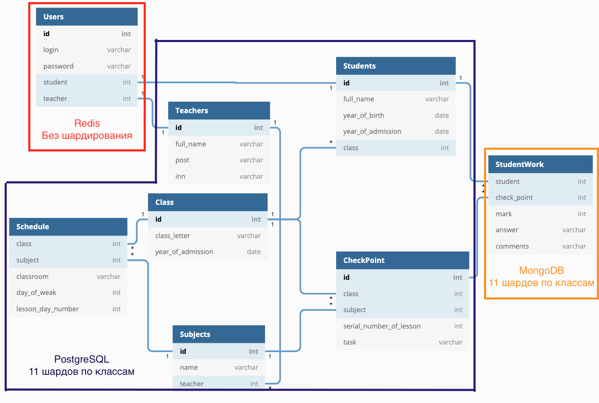

# Сервис онлайн карт помещений
## Тема
Сервис "Всероссийский электронный дневник школьника"
## Определение возможного диапазона нагрузок 
МЭШ - Московская электронная школа расчитана только на жителей Москвы. По данным [росстата](https://rosstat.gov.ru/bgd/regl/b20_111/Main.htm) 1 млн детей и подростков в возрасте от 7 до 18 лет учаться в московских школах. 
По данным на [2016 год](https://www.mos.ru/news/item/15697073/?utm_source=search&utm_term=serp) из 169 московских школ, в которых была введена система "Электронный дневник", количество пользователей-кольников составляет 400 тыс. человек. А количество уникальных пользователей в месяц - 1 млн.
Исходя из данных о [средней наполняемости школ](https://medportal.ru/enc/parentschildren/school/16/#:~:text=%D0%A7%D0%B0%D1%81%D1%82%D0%BD%D1%8B%D1%85%20%D1%88%D0%BA%D0%BE%D0%BB%20%D0%B2%20%D0%A0%D0%BE%D1%81%D1%81%D0%B8%D0%B8%20%D0%BD%D0%B0%D1%81%D1%87%D0%B8%D1%82%D1%8B%D0%B2%D0%B0%D0%B5%D1%82%D1%81%D1%8F,%D1%87%D0%B0%D1%81%D1%82%D0%BD%D0%BE%D0%B9%20%E2%80%93%20%D0%BE%D1%82%20100%20%D0%B4%D0%BE%20200.) в 950 человек, можно прийти к выводу, что сервисом эжедневно пользовался практически каждый школьник.

В среднем у учащегося 6 предметов в день, это означает, что для выполнения таких действий как: просмотр материалов по курсу, просмотр домашних заданий, просмотр оценок, загрузка домашних заданий, потребуется `6 * 4 = 24` запросов в день.

В среднем у учителя 6 уроков в день в классах по 18 человек (согласно [статистике росстата](https://www.mk.ru/social/2020/09/30/kolichestvo-shkolnykh-uchiteley-rezko-sokrashhaetsya-nashli-udobnuyu-alternativu.html)) это означает, что для выполнения таких действий как: проверка домашних заданий, выставление оценок, отслеживание посещаемости требуется `6 * 18 * 3 = 324` запроса в день.

Итого `(1 000 000 * 24 + 324 * 1 000 000 / 18) / (24 * 60 * 60) = 486` rps - нагрузка на Московский электронный дневник.

## Выбор планируемой нагрузки
Сервис ориентирован на российскую аудиторию. По данным [росстата](https://rosstat.gov.ru/bgd/regl/b20_111/Main.htm) 24.8 млн детей и подростков в возрасте от 7 до 18 лет. Учитывая [проникновение интернета в России на 2020 год](https://www.web-canape.ru/business/internet-2020-globalnaya-statistika-i-trendy/) в 81%, получаем: `24.8 * 81% = 19.8` пользователей-школьников по России.
Во время противовирусного карантина все школы вынуждены использовать электронные дневники. В месяц к пользователям добавляются родители, ежемесечно проверяющие результаты учебы школьников. Ориентируясь на соотновешние учеников / родителей в Москве - `400 / 550`, учитывая соотношение школьников в Москве / России - `1 / 19.8`, получаем:
- `19.8 + 550 / 400 * 19.8 = 47` млн. пользователей в месяц.
- `468 * 19.8 = 9266` - среднее значение rps

## Логическая схема базы данных
Выделенные сущности: 
- пользователь, 
- преподаватель, 
- ученик, 
- класс, номер класса опредеется годом начала обучения параллели, буква класса хранится отдельно, 
- контрольная точка, домашняя или кантрольная работа или другое мероприятие,
- предмет, представлен названием предмета, позволяет реализовать ситуацию, в которой один преподаватель ведет много предметов,
- ответ студента на задание содержит, помимо оценки и самого ответа, комментарии к заданию, хранимые строкой в денормализованном виде, что позволит сэкономить на операции join между крупными таблицами самих отевтов и комментариев, приведя отношения "многие комментарии к одному заданию" в отношения один-к-одному.

## Физическая система хранения
Исходя из модели предметной области, можно сделать наблюдения:
1) От сущности пользователя не зависят остальные, что позволяет создать на ее основе отдельный сервис авторизации.
2) Такие сущности как: преподаватель, ученик, класс и контрольная точка практически не подвержены изменениям и создаются единыжды перед началом учебного года. Это означает, что основная операция, выполняемая над ними - чтение. 
3) Сущность ответа ученика потенциальна подвергнута частным изменениям.

Рассмотрим каждый пункт отдельно:
1) Реализуя сессия пользователя по технологии JWT, можно избавиться от необходимости верифицировать сессию пользователя, проверяя ее id в базе данных. Таким образом пользователю достаточно единыжды авторизоваться. 
Предположим, что авторизация выполняется раз в месяц, тогда при количестве пользователей в месяц `= 47` млн, получим средний rps
`47 000 000 / (30 * 24 * 60 * 60) = 18` rps
Предположим случай пиковой нагрузки, например, 1 сентября, когда все пользователи будут авторизовываться, получим средний rps
`47 000 000 / (24 * 60 * 60) = 5400` rps
И `54000` rps при 10-ти кратном запасе.
Расчитаем занимаемое на диске место одной записью в таблице:
| Поле          |  Память (байт)     |
| ------------- |------------------| 
|id |8 |
|login | ~40|
|password | ~40|
|student | 8|
|teacher | 8|
|Суммарно | 104|
Следовательно на 47 млн активных пользователей понадобится 4,5 ГБт.
С учетом того, что ежегодный прирост пользователей `= 47 / 11 = 4.3` млн, милимального объема памяти будет достаточно, чтобы обеспечить работу системы в течении многих лет.
Под задачи хранения данных подойдет noSQL база данных Reddis - хранящая базу в оперативной память в формате ключ-значение. Потенциально Redis может выдержать многократные (10-ти кратные) пиковые нагрузки в [50 тыс. rps](https://skipperkongen.dk/2013/08/27/how-many-requests-per-second-can-i-get-out-of-redis/) на минимальном железе, что дает значительный запас по производительности.

